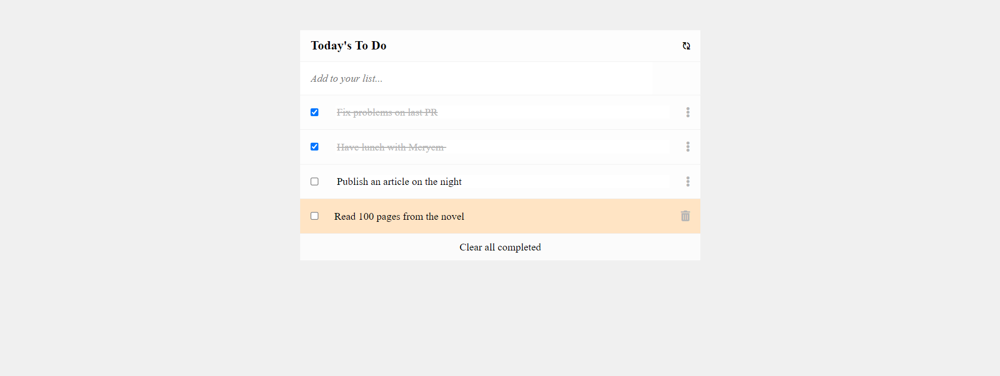

# To Do List

> Welcome to my to-do project



##### You can add, delete and update your to-do list with this project.

## Built With

- Major languages : HTML5, CSS, Vanilla JavaScript

## [Live Demo](https://nevisende.github.io/todo)


### Installation
```
$ git clone https://github.com/nevisende/todo.git

$ cd todo

and then installing the npm packages
$ npm i or npm install

```

### Start the server

```
npm start
```
Now enter localhost:3000 in the address bar of your browser.

### Dist Folder
``` 
npm build
```
Production files will be prepared in /dist folder.

## 👤 Author


- GitHub: [@nevisende](https://github.com/nevisende)
- Twitter: [@furkandnzhan](https://twitter.com/furkandnzhan)


## 🤝 Contributing

Contributions, issues, and feature requests are welcome!

Feel free to check the [issues page](../../issues/).

## Show your support

Give a ⭐️ if you like this project!

## 📝 License

This project is [MIT](./MIT.md) licensed.
